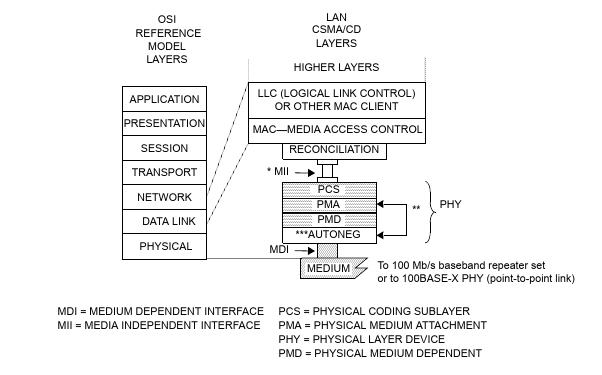
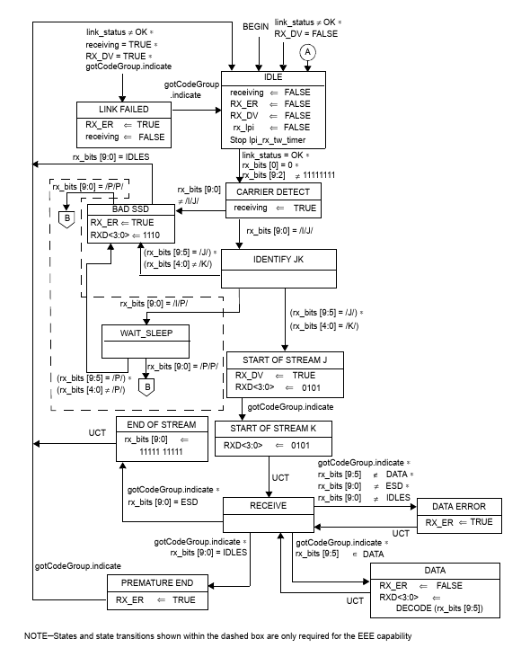

= The smallest inter-frame gap in Fast Ethernet
:tags: ethernet, pedantry

https://en.wikipedia.org/wiki/Fast_Ethernet[Fast Ethernet] in the form of
100BASE-TX is a very mature technology, although there were
http://www.sigcon.com/Pubs/news/5_7.htm[some hiccups in getting there]. So it
was surprising to me to find a way for the PCS receiver to accept an
inter-frame gap shorter than the end-of-stream delimeter itself.

The 100BASE-TX Ethernet physical layer is broken up into several sub-layers:

Working from the bottom up, the PMD converts analog signals from the medium to
https://en.wikipedia.org/wiki/MLT-3_encoding[MLT-3 symbols] (correcting for
channel loss and baseline wander), decodes those symbols to bits, descrambles
the bits, and then encodes the bits with NRZI. The PMA converts from NRZI back
to bitsfootnote:[Converting from binary to NRZI and back again is not terribly efficient (and I suspect that almost no integrated implementations of 100BASE-TX include it). So why is it specified in the standard? The 100BASE-TX PMD is largely based on the CDDI (Copper Distributed Data Interface) PMD. That PMD was designed to be a drop-in replacement for the FDDI (Fiber Distributed Data Interface) PMD, so that the PCS and PMA could be reused. The FDDI PMD just performed some filtering and conversion from optical to electrical signalling (much like modern optical SFP modules). The NRZI conversion itself was done in the PMA. To keep compatibility, the PMD decodes MLT-3 symbols and then re-encode them as NRZI. This is also why descrambling happens in the PMD, even though it probably should happen in the PMA.]
and performs some other optional tasks (such as far-end fault detection when
using a medium without autonegotiation). The PCS performs
https://en.wikipedia.org/wiki/4B5B[4B5B]footnote:[Also inherited from FDDI]
alignment and decoding and generates data on the MII.

The PMA provides the PCS with a raw stream of bits. There is no indication of
where one nibble begins and another ends. To recover this information, each
nibble (4 bits) is encoded using 5 bits. Half of this encoding is used for
data, but the other half is either invalid or used for control code groups.
When no data is being transferred, the /I/ control code group (0b11111) is
continuously transmitted. The control code groups /J/ and /K/ (0b11000 and
0b10001) form the Start-of-Stream Delimiter (SSD), indicating the start of a
new frame:

++++

++++

To ensure that this sequence can always be recognized, all other code groups
which (in combination with any other code group) could contain the sequence
0b1100010001 are invalid. The control code groups to cover are /T/ and /R/
(0b01101 and 0b00111), which form the End-of-Stream Delimiter (ESD), indicating
the end of a frame. By convention, /V/ is used for invalid code groups.

IEEE 802.3 specifies the PCS receiver through a state diagram. Each state
performs its actions continuously, and has several conditions leading to other
states. Conditions are formed of several comparisons or events, with `*`
expressing "`and`" (conjunction). All conditions are evaluated continuously
(more on this later), and sometimes there are uncontrolled transitions (UCTs),
immediately transitioning from one state to another.

The variables used in the above diagram are:

link_status:: Whether the link is up. For our purposes, we can assume that
              this is always true.
rx_bits:: The last 10 bits we have received. The least significant bit (0) is
	  the most recent bit. These are not aligned, except when
	  gotCodeGroup.indicate occurs. In that case, rx_bits[4:0] is the most
	  recent code group, and rx_bits[9:5] is the next most recent.
gotCodeGroup.indicate:: This event occurs whenever there is a complete code
			group in rx_bits. It is automatically generated every
			five bits by the receive bits process (not shown). The
			initial alignment is determined by when RX_DV goes
			high.
RX_DV:: An MII signal indicating whether RXD is valid or not. This also
        determines the alignment of gotCodeGroup.indicate.
RXD:: An MII signal indicating the recieved data.
RX_ER:: An MII signal indicating there was an error.
receiving:: Whether we are currently receiving a packet.
rx_lpi:: This is only used for Energy-Efficient Ethernet (EEE).

Let's add some of these signals to the SSD diagram from before:

++++

++++

There are a few important things to note here. First, note that there is an
instant transition from CARRIER DETECT to IDENTIFY JK. This is because one of
the conditions for exiting CARRIER DETECT will always be true, and both will be
evaluated immediately. Second, although state and gotCodeGroup.indicate are
shown as having transition times, they are really instant from the state
machine's point of view. In particular, gotCodeGroup.indicate is only true for
one instant. If a state and its successor both depend on gotCodeGroup.indicate
to transition, they can't both transition off of the same gotCodeGroup.indicate
event. If implemented in hardware, states like CARRIER DETECT should be viewed
more as "`superstates`" (a la superclass) rather than states proper. The last
thing to note is that there's a delay of two code groups between when the first
bit of a code enters the PCS and when the data gets signalled on the MII.

Now, lets's look at the end of a packet:

++++

++++

Note that like CARRIER DETECT, END OF STREAM instantly transitions to IDLE, but
not before setting rx_bits to all 1s. This is as if we had already been sending
/I/I/ instead of /T/R/. We can abuse this to create (through non-standard
coding) the shortest possible inter-packet gap. The following diagram shows
the contents of rx_bits after END OF STREAM as "`virtual`" bits. It also shows
the actual received bits as "`real`" bits:

++++

++++

A fully-compliant 100BASE-X PCS will exactly follow the state transitions in
the diagram above, allowing an inter-frame gap of just 0.8 octets.

It appears that the designers of the PCS state machine wished to allow
back-to-back frames (e.g. /T/R/J/K/)footnote:[I don't know whether back-to-back frame support was inherited from FDDI or was introduced with Fast Ethernet. It's likely that someone produced PCSs which allowed this, and lobbied to ensure that such behavior remained standard].
If this is indeed the case, we need to be careful when fixing the state
machine. We could omit the clearing of rx_bits, but this would cause us to
erroneously transition to BAD SSD (as we would transition to CARRIER DETECT
when rx_bits[9:0] = /R/J/). Adding a condition on gotCodeGroup.indicate would
not work for similar reasons.  Instead, we should add an intermediate PRE IDLE
state after END OF STREAM. This state would set receiving, RX_ER, and RX_DV to
FALSE. It would transition to IDLE on gotCodeGroup.indicate.

In practice, this "`bug`" has no consequences. This is for three reasons.
First, conforming PCSs can never generate this bit pattern. Second, conforming
MACs use an inter-frame gap of at least 12 octets. And, third, most PCSs do not
implement the specification exactly. This is because an exact implementation
imposes difficult-to-meet timing requirements due to the tight coupling between
the receive bits process and the recieve process. A typical implementation may
register the outputs of the receive bits process, which does not allow for the
instant feedback necessary to re-align the receive bits process and trigger the
bug.
